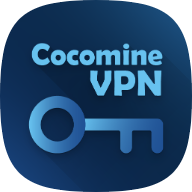

Cocomine VPN Extension 
===

感謝你安裝本瀏覽器擴充插件，本插件是為了方便您使用Cocomine VPN服務而開發的，您可以通過本插件快速連接到Cocomine VPN服務器，享受更快的網絡速度。

注意事項
---
+ 本插件僅支持Cocomine VPN服務，請確保您已經註冊了Cocomine VPN服務。
+ 本插件需要您的許可才能訪問您的瀏覽數據，請放心，我們不會收集您的任何數據。
+ 本插件不會干擾您的瀏覽體驗，您可以隨時啟用或禁用本插件。
+ 請注意，使用我們的本插件並不會為您的連線提供額外的加密保障。 本插件主要是為了幫助您更改您的IP位址和位置，而不是為了提供額外的安全或隱私保護。 如果您需要額外的加密保障，我們建議您使用HTTPS連接或考慮使用其他安全措施。
+ 如果您有任何問題或建議，請隨時通過電子郵件與我們聯繫：[cocomine@cocomine.cc](mailto:cocomine@cocomine.cc)

使用方法
---
先前往網站開啟你需要的節點

當節點開啟後, 如果你有成功安裝擴充插件, 你將會看到一鍵連線的按鈕

當你連線後, 在右上角可以開啟擴充功能介面, 你將可以看到連接狀態

當你不需要連線時, 你可以按下按鈕斷開連線

當你沒有連接任何節點時, 亦可以按下按鈕開啟網頁

Update Log
===

0.1.3
---
+ 增加chatgpt only功能模式, 開啟後只代理chatgpt.com和openai.com的網站

0.2.0
---
+ 增加自訂代理規則功能